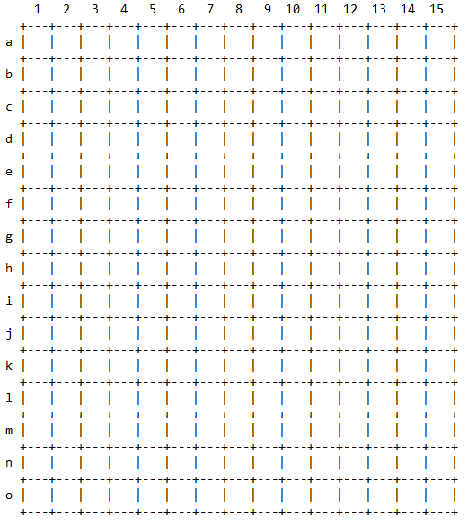
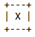
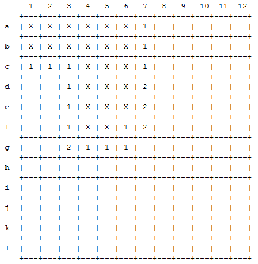
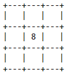
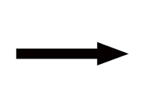
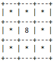
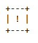

User Manual for Team D's MineSweeper
===

## Getting the application
1. From a command prompt (or terminal shell), `cd` to your workspace directory
2. Clone `MineSweeperD` into your workspace with the command 
`git clone https://github.com/BalboaAPCS1/MineSweeperD`

## Running the application
1. From a command prompt (or terminal shell), `cd` to the directory where you cloned the `MineSweeperD` repository.
2. `cd` to the src folder 
3. Compile and run the application
	1. `javac Controller.java` to compile the class
	2. `java Controller` to run the class

## Playing the Game
### Objective
The objective of the game is to clear out all tiles while avoiding the tiles that conceal a mine. Player wins when all tiles, other than mines, are cleared.

### Controlling the game
When the game begins, User will be prompted to select a difficulty

Difficulty| Size
---|---
E | creates an 8x8 board
M | creates a 12x12 board
H | creates a 15x15 board

Pick a location by typing the row letter then the column number. (Refer to image above)

Ex: b4 , a15 , o15 , f8

#### Commands
Command| Function
---|---
f (location) | Flags the location
u (location) | Unflags the location
i (location) | Inspects the location
Q | Quits the game

#### Symbols And Meanings

A square with an X indicates that the square has already been inspected

(When inspecting, mines will be continually inspected until a square with a number is reached)

      

A square with a number indicates how many mines it is touching

A square with an exclamation point indicates that it has been flagged

